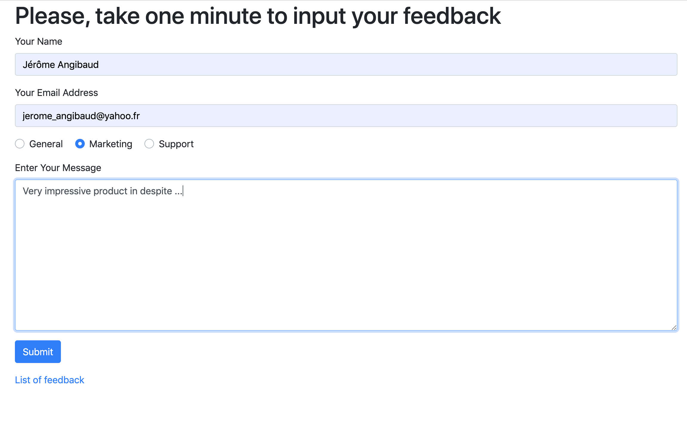

# Application technical stack

The application runs on springboot backed by an in-memory H2 database. The db state is reset at 
each application reboot with 3 pre-filled feedback.

The client side code is located in *src/main/resources/static*. It does not rely on any framework or third party lib.

# How to run the server

Execute `./mvmw spring-boot:run` in a terminal. This builds the application and run the server.

# How to use the application

* Open your browser at : http://localhost:8080 to display feedback list.

 

Use the radio-button above to filter or change the time ordering direction (I know, pretty ugly :-) )

Click on the link below to add a new Feedback. You will be redirected to the form page :

.

From here you can add one feedback. Once feedback added successfully, a success notification 
appears, and the submit button disappears (user is not supposed to enter several feedback in a row).

Note : the corner case consisting in submitting a blank message (one or several spaces) is not handled properly.

# How to execute tests

Execute `./mvmw test`

